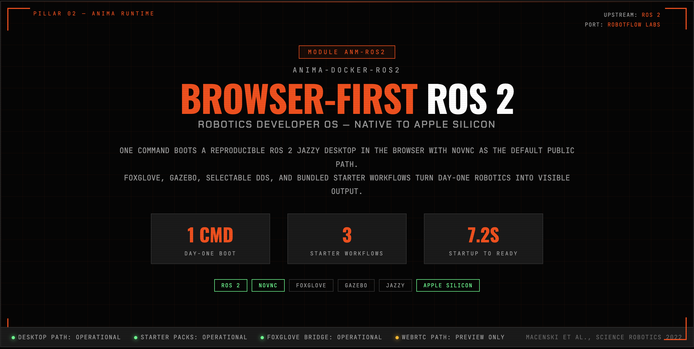
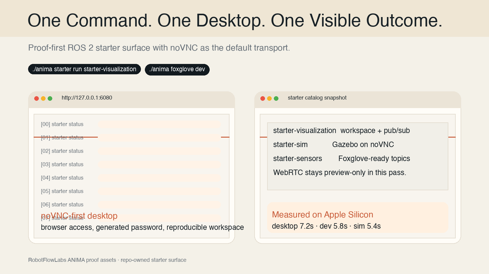
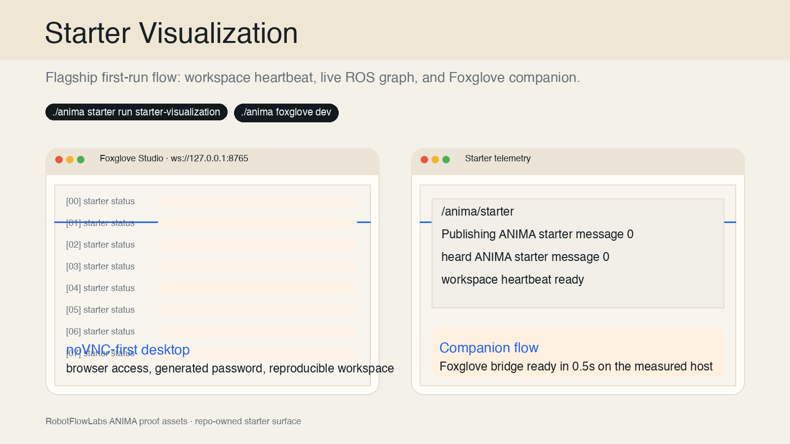
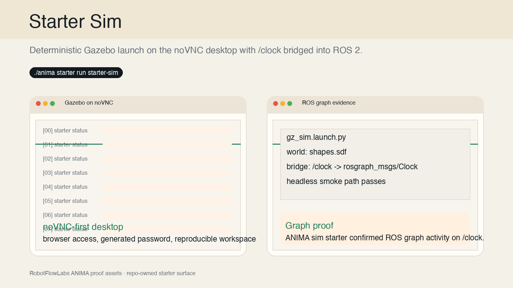
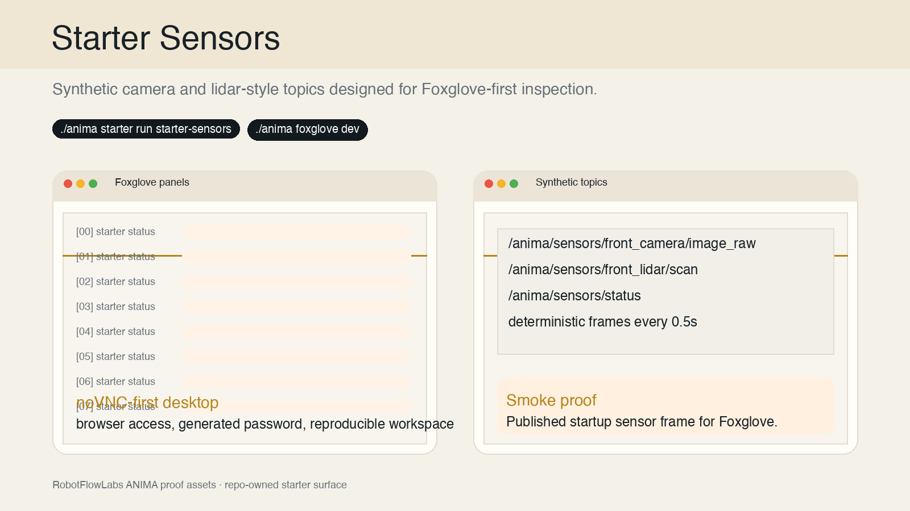
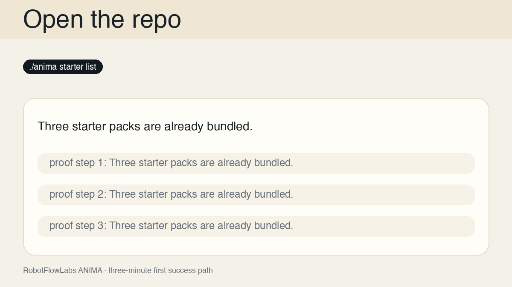

# RobotFlowLabs ANIMA ROS 2

RobotFlowLabs ANIMA ROS 2 gives you a browser-first ROS 2 desktop that reaches a visible result on day one: one command, one noVNC session, and starter workflows that already prove the stack is useful.

noVNC is the default transport. WebRTC stays preview-only in this release surface.



## First Success

The default public path stays simple:

```bash
./anima starter run starter-visualization
./anima foxglove dev
```

What that path gives you:

- a working noVNC desktop at `http://127.0.0.1:6080`
- a built workspace under `/workspaces/anima`
- live ROS 2 pub/sub traffic
- a Foxglove companion path on `ws://127.0.0.1:8765`

If you want the shortest desktop-only path first:

```bash
make up
```

## Visible Proof

| Default Desktop | Visualization Starter | Simulation Starter |
| --- | --- | --- |
|  |  |  |

| Sensor Starter | Three-Minute Path |
| --- | --- |
|  |  |

## Choose Your Starter

| Starter | Command | Recommended Profile | Visible Outcome | Companion |
| --- | --- | --- | --- | --- |
| `starter-visualization` | `./anima starter run starter-visualization` | `dev` | workspace heartbeat plus live ROS 2 graph | `./anima foxglove dev` |
| `starter-sim` | `./anima starter run starter-sim` | `sim` | Gazebo on the noVNC desktop with `/clock` bridged into ROS 2 | `./anima foxglove sim` |
| `starter-sensors` | `./anima starter run starter-sensors` | `dev` | deterministic image and lidar-style topics for Foxglove | `./anima foxglove dev` |

List and inspect the bundled starter catalog:

```bash
./anima starter list
./anima starter show starter-sim
./anima starter show starter-sensors
```

## GHCR Install

GHCR is the only supported registry in this phase.

Pull the published images:

```bash
docker pull ghcr.io/RobotFlow-Labs/anima-ros2:jazzy-desktop
docker pull ghcr.io/RobotFlow-Labs/anima-ros2:jazzy-dev
docker pull ghcr.io/RobotFlow-Labs/anima-ros2:jazzy-sim
```

Run the desktop image:

```bash
docker run --rm \
  -e VNC_PASSWORD=change-me \
  -p 6080:6080 \
  -p 5901:5901 \
  -p 8080:8080 \
  -p 8765:8765 \
  ghcr.io/RobotFlow-Labs/anima-ros2:jazzy-desktop
```

Run the dev or sim images with the desktop entrypoint:

```bash
docker run --rm \
  -e VNC_PASSWORD=change-me \
  -p 6080:6080 \
  -p 5901:5901 \
  -p 8080:8080 \
  -p 8765:8765 \
  ghcr.io/RobotFlow-Labs/anima-ros2:jazzy-dev \
  desktop
```

```bash
docker run --rm \
  -e VNC_PASSWORD=change-me \
  -p 6080:6080 \
  -p 5901:5901 \
  -p 8080:8080 \
  -p 8765:8765 \
  ghcr.io/RobotFlow-Labs/anima-ros2:jazzy-sim \
  desktop
```

## Trust Strip

Current benchmark snapshot from [docs/MEASUREMENTS.md](docs/MEASUREMENTS.md):

| Tag | Startup To Ready | Local arm64 Image Size |
| --- | --- | --- |
| `jazzy-desktop` | `7.2s` | `0.81 GiB` |
| `jazzy-dev` | `5.8s` | `0.83 GiB` |
| `jazzy-sim` | `5.4s` | `1.03 GiB` |

Current validation surface:

- Apple Silicon source checkout validated on `2026-04-01`
- compose config checked for default, `dev`, `sim`, and bind-mounted modes
- starter smoke coverage for `starter-visualization`, `starter-sim`, and `starter-sensors`
- signed release images and attached SBOM artifacts defined in [docs/RELEASE_GUIDE.md](docs/RELEASE_GUIDE.md)
- WebRTC is preview-only and is not the default support path

## Key Commands

```bash
./anima up
./anima status
./anima password
./anima starter list
./anima starter run starter-visualization
./anima starter run starter-sim
./anima starter run starter-sensors
./anima foxglove dev
./anima stop
```

## Docs

- Mac quickstart: [docs/QUICKSTART_MAC.md](docs/QUICKSTART_MAC.md)
- Commands: [docs/COMMANDS.md](docs/COMMANDS.md)
- Support matrix: [docs/SUPPORT_MATRIX.md](docs/SUPPORT_MATRIX.md)
- Release guide: [docs/RELEASE_GUIDE.md](docs/RELEASE_GUIDE.md)
- Measurements: [docs/MEASUREMENTS.md](docs/MEASUREMENTS.md)
- Image matrix: [docs/IMAGE_MATRIX.md](docs/IMAGE_MATRIX.md)
- Hardware overlays: [docs/HARDWARE.md](docs/HARDWARE.md)
- Devcontainer workflow: [docs/DEVCONTAINER.md](docs/DEVCONTAINER.md)

## Community

- Contributing guide: [CONTRIBUTING.md](CONTRIBUTING.md)
- Code of conduct: [CODE_OF_CONDUCT.md](CODE_OF_CONDUCT.md)
- Security policy: [SECURITY.md](SECURITY.md)
- Public security guidance: [docs/SECURITY.md](docs/SECURITY.md)
